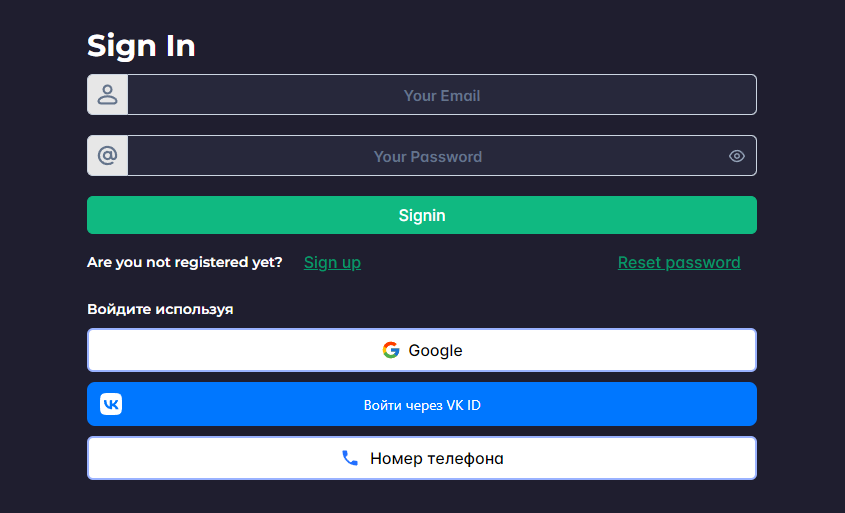

<h1 align="center">Register</h1>
<div align="center" id="top">

</div>
&#xa0;


<p align="center">
  

  

  

  

  
</p>


<p align="center">
  <a href="#dart-about">About</a> &#xa0; | &#xa0; 
  <a href="#sparkles-features">Features</a> &#xa0; | &#xa0;
  <a href="#rocket-technologies">Technologies</a> &#xa0; | &#xa0;
  <a href="#white_check_mark-requirements">Requirements</a> &#xa0; | &#xa0;
  <a href="#checkered_flag-starting">Starting</a> &#xa0; | &#xa0;
  <a href="#memo-license">License</a> &#xa0; | &#xa0;
  <a href="https://github.com/matmon12" target="_blank">Author</a>
</p>

<br>

## :dart: About

Website created to consider the main types of authentication: google, VK ID, phone number, email. The project also used interaction with the Firebase database. A dashboard prototype was also implemented.

## :sparkles: Features

:heavy_check_mark: Registration and authorization using VK ID, Google, phone number and email;\
:heavy_check_mark: Implementation of light and dark themes;\
:heavy_check_mark: Two-factor authentication;\
:heavy_check_mark: Layout of email letters;\
:heavy_check_mark: Implementation of different types of diagrams;\
:heavy_check_mark: Separation of access rights on the site;\
:heavy_check_mark: Read and write with realtime database Firebase;\
:heavy_check_mark: Form Validation;\
:heavy_check_mark: Password reset;

## :rocket: Technologies

The following tools were used in this project:

- [Vue](https://vuejs.org/)
- [Firebase](https://console.firebase.google.com/)
- [CASL](https://casl.js.org/v6/en)
- [VK ID SDK](https://dev.vk.com/ru/vkid)
- [VueUse](https://vueuse.org/)
- [Chart.js](https://www.chartjs.org/docs/latest/)
- [Pinia](https://pinia.vuejs.org/)
- [Vite](https://vitejs.dev/)
- [PrimeVue](https://primevue.org/)
- [Vue Query](https://vue-query.vercel.app/#/)
- [VeeValidate](https://vee-validate.logaretm.com/v4/)
- [VueTelInput](https://vue-tel-input.iamstevendao.com/)
- [Vue3-Otp-Input](https://github.com/ejirocodes/vue3-otp-input)
- [Yup](https://github.com/jquense/yup)

## :white_check_mark: Requirements

Before starting :checkered_flag:, you need to have [Git](https://git-scm.com) and [Node](https://nodejs.org/en/) installed.

## :checkered_flag: Starting

```bash
# Clone this project
$ git clone https://github.com/matmon12/register

# Access
$ cd register

# Install dependencies
$ npm install

# Run the project
$ npm run dev

# Compiles and minifies for production
$ npm run build
```
### Vue 3 + Vite

This template should help get you started developing with Vue 3 in Vite. The template uses Vue 3 `<script setup>` SFCs, check out the [script setup docs](https://v3.vuejs.org/api/sfc-script-setup.html#sfc-script-setup) to learn more.

### Recommended IDE Setup

- [VS Code](https://code.visualstudio.com/) + [Volar](https://marketplace.visualstudio.com/items?itemName=Vue.volar) (and disable Vetur) + [TypeScript Vue Plugin (Volar)](https://marketplace.visualstudio.com/items?itemName=Vue.vscode-typescript-vue-plugin).

## :memo: License

This project is under license from MIT. For more details, see the [LICENSE](LICENSE) file.

Made with :heart: by <a href="https://github.com/matmon12" target="_blank">Matmon</a>

&#xa0;

<a href="#top">Back to top</a>
